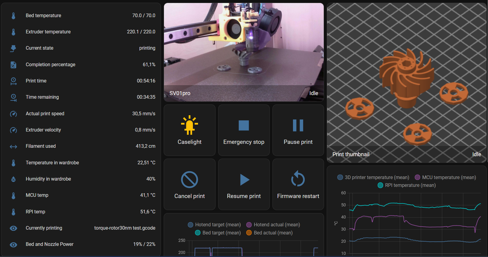
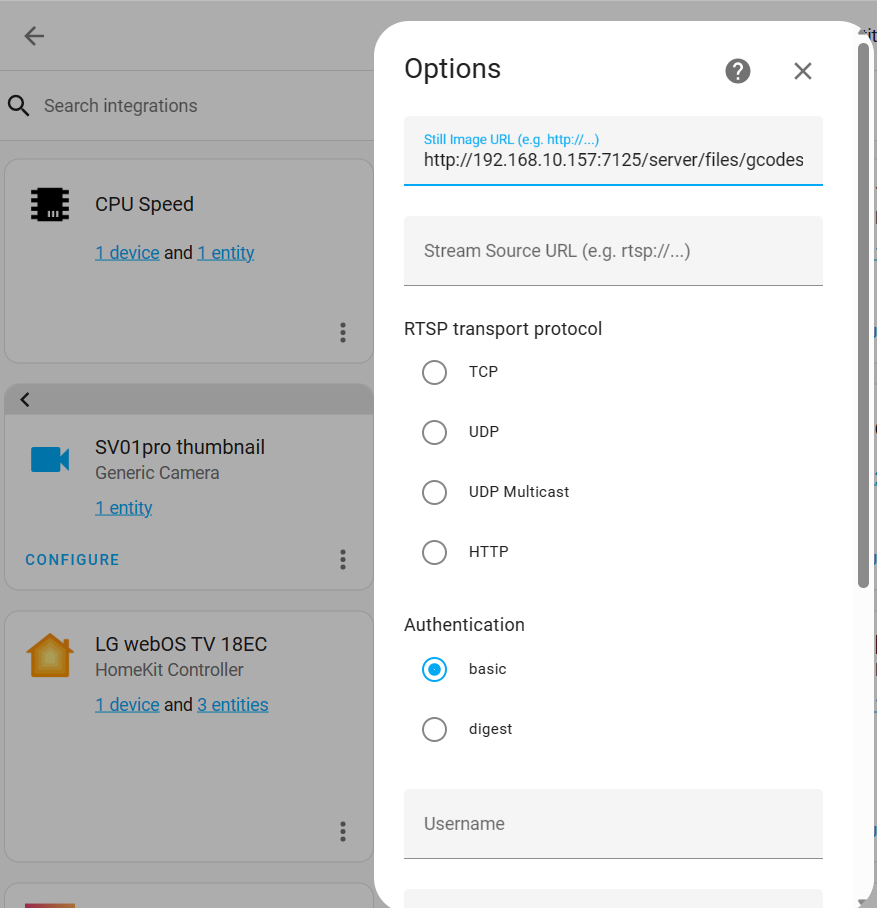
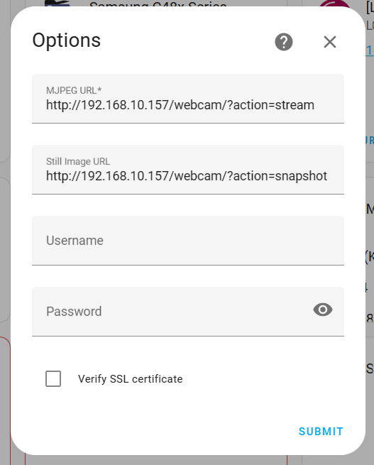

# Moonraker in Home Assistant

There is no official way or integration to do it, but it is doable via REST.
I haven't found any fully working solution, so based on my previous searches and attempts i made one working for myself, however few people asked me how to, so i'm sharing my configs.
These are NOT full configs to copy&paste, take it as a reference to modify them for your conditions, like cameras, IP addresses, names, etc. Most of the bits are quite intuitive, so if you go through code, you should be able to understand what is what if you have been playing with Home assistant for a while.
There is some stuff unused by me there too (yet or no more used), so feel free to do whatever you want with it.

MY config is split into files - sections, so first of all, make sure you know your config files well and you know what is what there, as your setup might be different - by default, all configs are thrown into configuration.yaml file, but i made couple of smaller files, easier to handle for me and makes it cleaner.


## Features
On the screenshot you can see what data I'm pulling from Moonraker to Home Assistant



## Thumbnail
Thumbnail is a bit tricky, basically you must add it in Devices, as a Generic Camera with refresh rate 1Hz. It does refresh the thumbnail from the generated URL (which is based on the currently printed filename, etc.), so double check everything there.



There is no password, no encryption, no nothing, just add below into Still Image URL and save
```sh
http://192.168.10.157:7125/server/files/gcodes/{{ states('sensor.sv01pro_url_thumbnail') }}
```

## Camera view
As for the camera I'm using a Pi camera via the Crowsnest plugin, so stream is available from that device too, this one is added as a MJPEG camera instead of generic (works better somehow).
MJPEG URL:
```sh
http://192.168.10.157/webcam/?action=stream
```
Still image URL:
```sh
http://192.168.10.157/webcam/?action=snapshot
```


## Action buttons
Most of them have got a pop-up where you must confirm the action before proceeding, just for your own safety to not hit them by accident.

```sh
cd dillinger
npm i
node app
```

For production environments...

```sh
npm install --production
NODE_ENV=production node app
```

## UI card
I have added everything into a separate UI card on the left of the menu, in the file there is yaml, so if you create one, just edit it as yaml and you can paste my content to start with it.


## Other files
As I've mentioned before, my config is split into couple of files, some rely on other ones, so best would be to paste them all in correct places of your Home Assistant configuration files, so you will need content of them all:
configuration.yaml - contains includes of other files, plus a bit of rest_command codes
customize.yaml - to change class of temp sensors, to be able to add them to graphs
rest.yaml - to pull some metadata
scripts.yaml - used for switches
sensor.yaml - used for sensors
switch.yaml - used for switches as well

## Automations based on pulled data
There is a file with sample automation just to give you an idea what you can do with the above data. Main thing that I wanted is notifications about failed print, completed print, etc.

## That's all folks!
Hope above stuff will hope someone to do their own stuff in Home assistant :)

[](https://www.buymeacoffee.com/fryc88)
